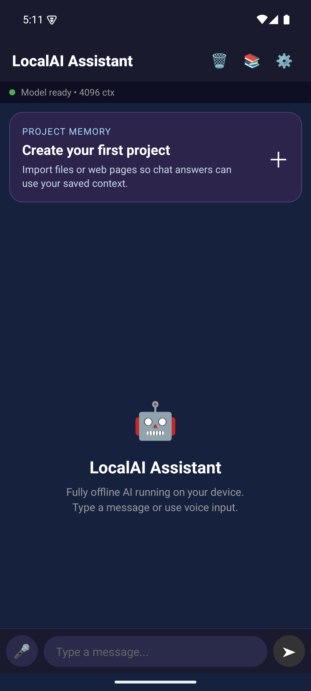
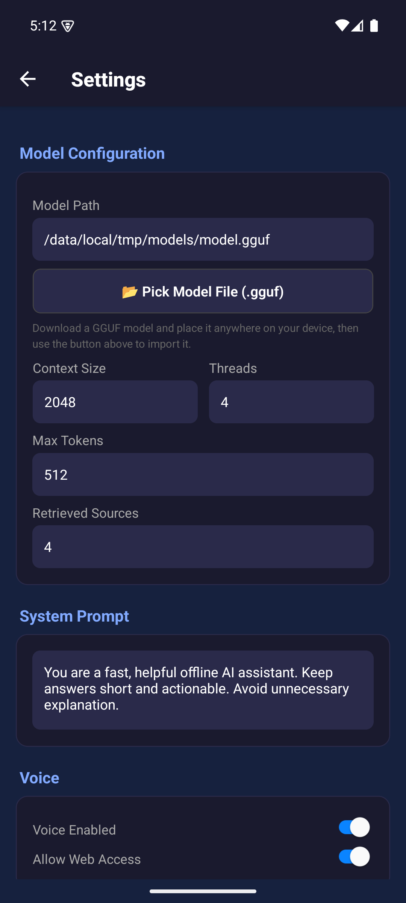
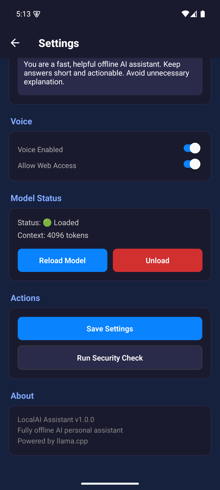

# PersonalAssistant

**Fully offline AI personal assistant for Android** — powered by llama.cpp on-device inference.

- No backend, no internet dependency
- Voice + Chat interface
- Project memory with local source retrieval
- Production-grade security (AES-256 encryption, root detection, ProGuard obfuscation)
- Runs GGUF quantized models directly on device

## Screenshots

<p align="center">
  
  &nbsp;
  
  &nbsp;
  
</p>

<p align="center">
  
  &nbsp;
  
</p>

| Screen | Description |
|---|---|
| **Chat Home** | Main chat interface with model status bar (green = loaded, 4096 ctx), project memory banner, voice input |
| **Settings (Top)** | Model path, Pick Model File button, context size, threads, max tokens, system prompt |
| **Settings (Bottom)** | Model status (loaded/unloaded), Reload/Unload, Save Settings, Security Check, About |
| **Project Memory** | Create projects, manage knowledge base for RAG-powered chat |
| **Import Sources** | Add files (MD, DOCX, XLSX, CSV, JSON), images, web pages, run web research |

## Architecture

```
React Native (TypeScript UI)
    ↓
Kotlin Native Module (JNI Bridge)
    ↓
llama.cpp (C++ GGUF Inference)
    ↓
On-device LLM (Mistral / LLaMA / Phi / TinyLlama)
```

## Requirements

- Node.js 18+
- Android Studio with NDK 27.x
- JDK 17+
- CMake 3.22+
- ~4–8GB device RAM for model inference

## Quick Start

### 1. Setup

```bash
# Windows
scripts\setup.bat

# macOS/Linux
chmod +x scripts/setup.sh && ./scripts/setup.sh
```

### 2. Download a GGUF Model

**Recommended:** Phi-3.1-mini-4k-instruct Q4_K_M (MIT license, ~2.3GB)

```bash
# Auto-download recommended model
scripts/download-model.sh    # macOS/Linux
scripts\download-model.bat   # Windows
```

Or choose based on your device RAM:

| Device RAM | Model | Size | Download |
|---|---|---|---|
| 4GB | TinyLlama 1.1B Q4_K_M | ~0.6GB | [HuggingFace](https://huggingface.co/TheBloke/TinyLlama-1.1B-Chat-v1.0-GGUF) |
| 6GB | **Phi-3.1-mini-4k Q4_K_M** (recommended) | ~2.3GB | [HuggingFace](https://huggingface.co/bartowski/Phi-3.1-mini-4k-instruct-GGUF) |
| 8GB+ | Mistral 7B Q4_K_M | ~4.1GB | [HuggingFace](https://huggingface.co/TheBloke/Mistral-7B-Instruct-v0.2-GGUF) |

Place the `.gguf` file anywhere on your device (e.g. Downloads), then:

- **In-app:** Open Settings → tap **"Pick Model File (.gguf)"** → select the file → tap **"Reload Model"**
- **Via ADB (dev):** `adb push models/your-model.gguf /data/local/tmp/models/model.gguf`

### 3. Run Development Build

```bash
npx react-native run-android
```

### 4. Build Production APK

```bash
# Generate signing keystore
keytool -genkey -v -keystore android/release.keystore \
  -alias localai-key -keyalg RSA -keysize 2048 -validity 10000

# Create keystore.properties from example
cp android/keystore.properties.example android/keystore.properties
# Edit android/keystore.properties with your passwords

# Build release APK
cd android && ./gradlew assembleRelease
```

APK output: `android/app/build/outputs/apk/release/app-release.apk`

## Project Structure

```
LocalAI-Assistant/
├── mobile-app/src/         # TypeScript application code
│   ├── components/         # React Native UI components
│   ├── screens/            # Chat & Settings screens
│   ├── services/           # LLM, Voice, Storage, Security services
│   ├── hooks/              # Custom React hooks (useLLM, useVoice)
│   ├── store/              # Zustand state management
│   ├── types/              # TypeScript type definitions
│   └── __tests__/          # Test suite
├── android/                # Android native code
│   └── app/src/main/
│       ├── cpp/            # C++ JNI bridge + llama.cpp
│       ├── java/           # Kotlin native modules
│       └── res/            # Android resources
├── models/                 # GGUF model files (git-ignored)
├── voice/                  # Vosk STT model (git-ignored)
└── scripts/                # Build & setup scripts
```

## Testing

```bash
# Run all tests
npm test

# Run with coverage
npm run test:coverage

# Run specific test file
npx jest --testPathPattern=PromptService
```

## Project Memory

The app now includes a project memory flow for retrieval-augmented chat on mobile:

- Create multiple projects and choose one as the active memory context
- Import local sources into a project library
- Add web pages and lightweight web research notes into the same library
- Chat automatically retrieves the most relevant saved chunks from the active project

Searchable in this build:

- Markdown, plain text, CSV, JSON
- DOCX
- XLSX
- Web pages
- Web research summaries

Stored as metadata-only in this build:

- PDF
- Images

That means PDFs and images can be tracked inside a project today, but they are not yet OCR or full-text indexed.

## Security Features

- **No network access**: INTERNET permission explicitly removed
- **AES-256-GCM encryption**: For sensitive local data
- **Root detection**: Warns on compromised devices
- **Anti-debugging**: Detects attached debuggers
- **ProGuard obfuscation**: Release builds are obfuscated
- **Encrypted storage**: MMKV with encryption key
- **Model protection**: Models can be encrypted on disk, decrypted in memory

## Tech Stack

| Layer | Technology |
|---|---|
| UI | React Native (TypeScript) |
| State | Zustand |
| AI Engine | llama.cpp via JNI |
| Voice STT | Vosk (offline) |
| Voice TTS | Android TTS (offline) |
| Storage | MMKV (encrypted) + SQLite |
| Security | AES-256-GCM, root detection |
| Build | Gradle + CMake + NDK |

## License

MIT
