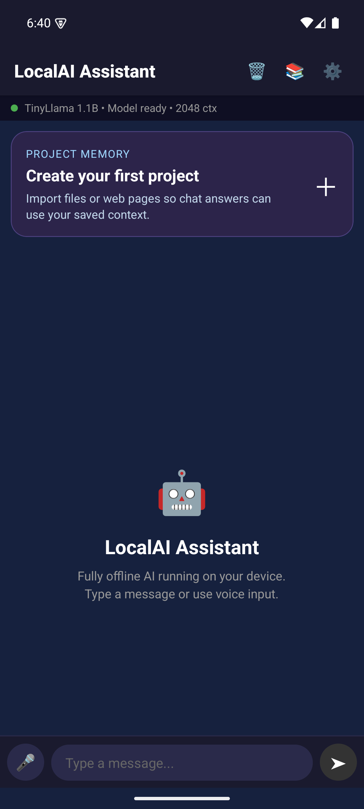
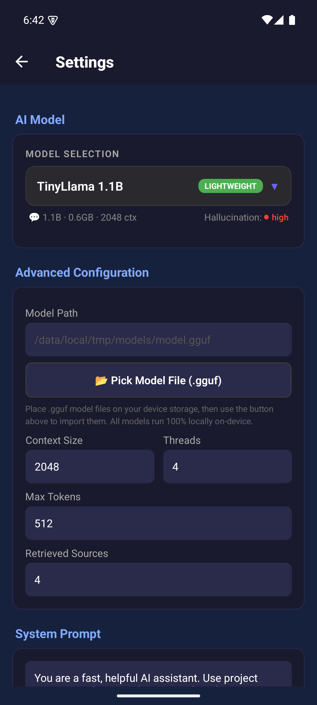
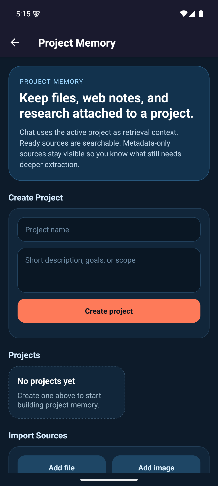
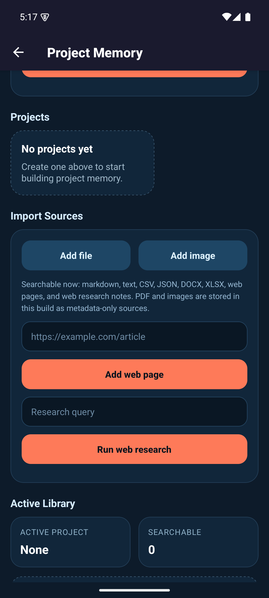

# PersonalAssistant

**Fully offline AI personal assistant for Android** — powered by llama.cpp on-device inference.

- No backend, no internet dependency, no cloud APIs
- All models run 100% locally on-device
- Default model (TinyLlama 1.1B) bundled directly in the APK
- Multi-model support with 10 pre-configured model profiles
- Voice + Chat interface
- Project memory with local source retrieval
- Production-grade security (AES-256 encryption, root detection, ProGuard obfuscation)
- Hallucination detection and prompt template management

## Screenshots

<p align="center">
  
  &nbsp;
  
  &nbsp;
  
</p>

<p align="center">
  
  &nbsp;
  
</p>

| Screen | Description |
|---|---|
| **Chat Home** | Verified on emulator with TinyLlama loaded locally from the bundled APK asset |
| **Settings** | Local-only configuration with GGUF import, context size, threads, and system prompt |
| **Model Selector** | Ranked local model catalog for fully offline on-device inference |
| **Project Memory** | Create projects, manage knowledge base for RAG-powered chat |
| **Import Sources** | Add files (MD, DOCX, XLSX, CSV, JSON), images, web pages, run web research |

## Architecture

```
React Native (TypeScript UI)
    ↓
Kotlin Native Module (JNI Bridge)
    ↓
llama.cpp (C++ GGUF Inference)
    ↓
On-device LLM — 100% Local, Zero Internet
```

## Local-Only Model System

All models run entirely on-device via llama.cpp. **No internet connection is required.**

### Bundled Model

The APK ships with **TinyLlama 1.1B Q4_K_M** (~638MB) pre-bundled. It is automatically extracted from APK assets on first launch — no setup needed.

### Supported Model Catalog (10 Models)

| Rank | Model | Parameters | Size | RAM | Tier | Hallucination Risk |
|------|-------|-----------|------|-----|------|--------------------|
| #1 | Phi-3.1 Mini 4K | 3.8B | 2.3GB | 4GB+ | Balanced | Low |
| #2 | Gemma 2 2B | 2B | 1.5GB | 3GB+ | Balanced | Medium |
| #3 | Qwen 2.5 3B | 3B | 2.0GB | 4GB+ | Balanced | Low |
| #4 | Mistral 7B v0.3 | 7B | 4.1GB | 8GB+ | Performance | Low |
| #5 | Llama 3.2 3B | 3B | 2.0GB | 4GB+ | Balanced | Medium |
| #6 | Llama 3.2 1B | 1B | 1.3GB | 3GB+ | Lightweight | High |
| #7 | **TinyLlama 1.1B** *(bundled)* | 1.1B | 0.6GB | 2GB+ | Lightweight | High |
| #8 | StableLM Zephyr 3B | 3B | 1.8GB | 4GB+ | Balanced | Medium |
| #9 | DeepSeek Coder 1.3B | 1.3B | 0.8GB | 2GB+ | Lightweight | Medium |
| #10 | Phi-3 Mini 128K | 3.8B | 2.3GB | 6GB+ | Performance | Low |

### Adding More Models

To use additional models beyond the bundled TinyLlama:

1. Place `.gguf` model files on your device storage (e.g., Downloads folder)
2. Open the app → Settings → tap **"Pick Model File (.gguf)"**
3. Select your model → it will be copied to the app's internal storage
4. Choose the model from the **Model Selector** dropdown

To bundle additional models in the APK at build time, place `.gguf` files in the `models/` directory before building.

## Requirements

- Node.js 18+
- Android Studio with NDK 27.x
- JDK 17+
- CMake 3.22+
- ~2–8GB device RAM for model inference

## Quick Start

### 1. Setup

```bash
# Windows
scripts\setup.bat

# macOS/Linux
chmod +x scripts/setup.sh && ./scripts/setup.sh
```

### 2. Verify Bundled Model

The default model (`models/tinyllama-1.1b-q4.gguf`) is included in the repository. Verify it exists:

```bash
# Windows
scripts\download-model.bat

# macOS/Linux
chmod +x scripts/download-model.sh && ./scripts/download-model.sh
```

### 3. Run Development Build

```bash
npx react-native run-android
```

### 4. Build Production APK

```bash
# Generate signing keystore
keytool -genkey -v -keystore android/release.keystore \
  -alias localai-key -keyalg RSA -keysize 2048 -validity 10000

# Create keystore.properties from example
cp android/keystore.properties.example android/keystore.properties
# Edit android/keystore.properties with your passwords

# Build release APK (includes bundled model ~638MB)
cd android && ./gradlew assembleRelease
```

APK output: `android/app/build/outputs/apk/release/app-release.apk`

> **Note:** The APK will be ~700MB+ because it includes the bundled TinyLlama model. This is by design — the model runs entirely offline with zero internet dependency.

## Project Structure

```
LocalAI-Assistant/
├── mobile-app/src/         # TypeScript application code
│   ├── components/         # React Native UI components
│   │   ├── ModelSelector   # Multi-model dropdown with 10 ranked models
│   │   ├── ModelStatusBar  # Real-time model status display
│   │   ├── ChatBubble      # Chat message rendering
│   │   └── ChatInput       # Voice + text input
│   ├── screens/            # Chat, Settings, Knowledge screens
│   ├── services/           # LLM, Prompt, Voice, Storage, Security
│   │   ├── LLMService      # Model loading, inference, asset extraction
│   │   └── PromptService   # 7 prompt templates, hallucination detection
│   ├── hooks/              # useLLM (model switching, hallucination checks)
│   ├── store/              # Zustand state management
│   ├── types/              # TypeScript types + MODEL_CATALOG (10 models)
│   └── __tests__/          # 113 tests across 12 suites
├── android/                # Android native code
│   └── app/src/main/
│       ├── cpp/            # C++ JNI bridge + llama.cpp
│       ├── java/           # Kotlin native modules
│       └── res/            # Android resources
├── models/                 # GGUF model files (bundled as APK assets)
│   └── tinyllama-1.1b-q4.gguf  # Default bundled model (~638MB)
├── voice/                  # Vosk STT model (git-ignored)
└── scripts/                # Build & setup scripts
```

## Features

### Multi-Model Support
- 10 pre-configured model profiles ranked by performance/accuracy/efficiency
- One-tap model switching with automatic memory management
- Per-model prompt templates (ChatML, Llama2, Phi3, Gemma, Mistral, Alpaca, Zephyr)
- Visual tier badges, hallucination risk indicators, and model stats

### Hallucination Detection
- Real-time confidence scoring on model responses
- Context-aware verification against project knowledge
- Automatic warnings for high-risk outputs
- Per-model hallucination risk profiling

### Memory Management
- Automatic model unloading before switching
- Context window token budget guards
- RAM usage estimation and recommendations
- Low-memory warnings for large models

### Project Memory (RAG)
- Create multiple projects and choose one as the active memory context
- Import local sources into a project library
- Add web pages and lightweight web research notes
- Chat automatically retrieves the most relevant saved chunks

## Testing

```bash
# Run all tests (113 tests, 12 suites)
npm test

# Run with coverage
npm run test:coverage

# Run specific test file
npx jest --testPathPattern=PromptService
```

## Security Features

- **No network access**: INTERNET permission explicitly removed
- **AES-256-GCM encryption**: For sensitive local data
- **Root detection**: Warns on compromised devices
- **Anti-debugging**: Detects attached debuggers
- **ProGuard obfuscation**: Release builds are obfuscated
- **Encrypted storage**: MMKV with encryption key
- **Local-only models**: All AI inference happens on-device

## Tech Stack

| Layer | Technology |
|---|---|
| UI | React Native (TypeScript) |
| State | Zustand |
| AI Engine | llama.cpp via JNI |
| Models | GGUF quantized (bundled in APK) |
| Voice STT | Vosk (offline) |
| Voice TTS | Android TTS (offline) |
| Storage | MMKV (encrypted) + SQLite |
| Security | AES-256-GCM, root detection |
| Build | Gradle + CMake + NDK |

## License

MIT
